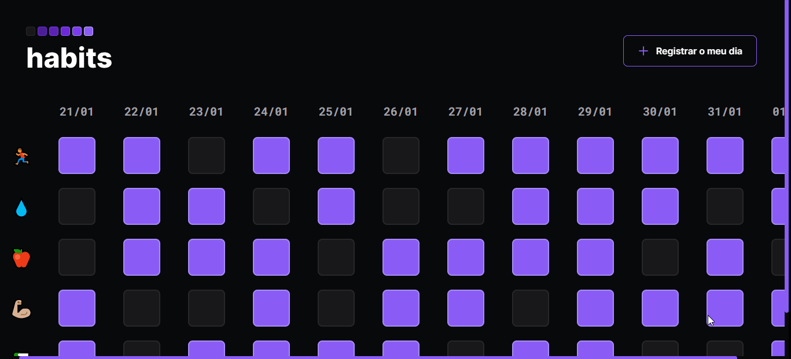

<h1 align="center"> Habits </h1>

  <a href="#-technologies">Technologies</a>&nbsp;&nbsp;&nbsp;|&nbsp;&nbsp;&nbsp;
  <a href="#-project">Project</a>&nbsp;&nbsp;&nbsp;|&nbsp;&nbsp;&nbsp;
  <a href="#-layout">Layout</a>&nbsp;&nbsp;&nbsp;|&nbsp;&nbsp;&nbsp;
  <a href="#-license">License</a>

  

 

  

## 🚀 Technologies

This project was developed with the following technologies:

- HTML and CSS
- JavaScript and JSON
- Git and GitHub
- Figma

## 💻 Project

Habits is an app that helps you track your habits.

[Click here to access the website](https://httpedroluiz.github.io/Habits/)

## 🎨 Layout

You can view the layout of the project through [THIS LINK](https://www.figma.com/file/KYA1IiJ3KqUyxQfziragkK/Habits-(e)-(Community)). You need an account on [Figma](https://figma.com) to access it.

## 📃 License

This project is under the MIT license.

---